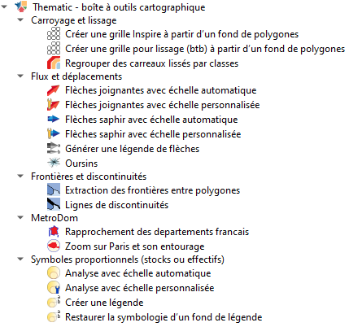

# Thematic

L'installation possible depuis le dépôt d'extension :
[sed67_mcvs_carto.pages.lab.sspcloud.fr/tools4qgis/plugins.xml](https://sed67_mcvs_carto.pages.lab.sspcloud.fr/tools4qgis/plugins.xml)
